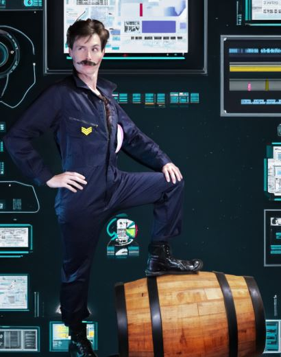

<!DOCTYPE html>
<html lang="en">
<head>
    <meta charset="UTF-8">
    <meta name="viewport" content="width=device-width, initial-scale=1.0">
    <title>Alien Gallery | The Laboratory Theater of Florida</title>
    
</head>
<body>

    <header>
        

            THE LAB
            
Intentionally innovative live theater

        

    </header>
    <main>
        

            

            

            

            

        

    </main>

</body>
</html>
